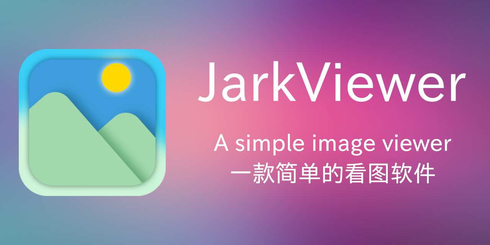

# jarkViewer



### 操作方式：

1. 切换图片：鼠标在窗口左右边缘滚轮，或左/右键、PgUp/PgDown键

1. 放大缩小：鼠标在窗口中间区域滚轮，或上/下键

1. 旋转图像：鼠标在窗口左上角/右上角滚轮或单击，或Q/E键

1. 平移图像：鼠标拖动，或WASD键进行上下左右平移

1. 图像信息：滚轮键，或 i 键

1. 复制信息：空格，或C键

1. 切换全屏：双击，或F11键

1. 快捷退出：右键，或ESC键

### 其他

1. 自动记忆上次窗口位置/尺寸

1. 支持读取AI生图（stable-diffusion，Flux）的提示词等信息


### 静态图像支持：
apng avif avifs bmp bpg dib exr gif hdr heic heif ico icon jfif jp2 jpe jpeg jpg jxl jxr pbm pfm pgm pic png pnm ppm psd pxm ras sr svg tga tif tiff webp wp2

### 动态图像支持：
gif webp png apng jxl

### RAW格式支持：
crw pef sr2 cr2 cr3 nef arw 3fr srf orf rw2 dng raf raw kdc x3f mrw

---

## 编译前操作

1. 解压 `jarkViewer/lib/lib.7z` 所有 `*.lib` 静态库
2. 解压 `jarkViewer/libexiv2/libexiv2.7z` 所有 `*.lib` 静态库
3. 解压 `jarkViewer/libopencv/libopencv.7z` 所有 `*.lib` 静态库
4. 解压 `jarkViewer/libpng/libpng.7z` 所有 `*.lib` 静态库

或者开启vcpkg支持，然后手动安装第三方库
```sh
vcpkg install giflib:x64-windows-static
vcpkg install x265:x64-windows-static
vcpkg install zlib:x64-windows-static
vcpkg install libyuv:x64-windows-static
vcpkg install exiv2[core,bmff,png,xmp]:x64-windows-static
vcpkg install libavif[core,aom,dav1d]:x64-windows-static
vcpkg install libjxl[core,tools]:x64-windows-static
vcpkg install libheif[core,hevc]:x64-windows-static
vcpkg install libraw[core,dng-lossy,openmp]:x64-windows-static
vcpkg install opencv4[core,ade,contrib,default-features,eigen,ffmpeg,freetype,gdcm,gstreamer,halide,ipp,jasper,jpeg,lapack,nonfree,openexr,opengl,openjpeg,openmp,openvino,ovis,png,python,qt,quirc,sfm,tbb,tiff,vtk,vulkan,webp,world]:x64-windows-static
```

---

# 若运行软件提示缺少 ``*.dll``

请下载安装 `VC++ 2015-2022` 运行库：

[Microsoft Visual C++ 2015-2022 Redistributable (x64)](https://aka.ms/vs/17/release/vc_redist.x64.exe) 

---

# 预览


