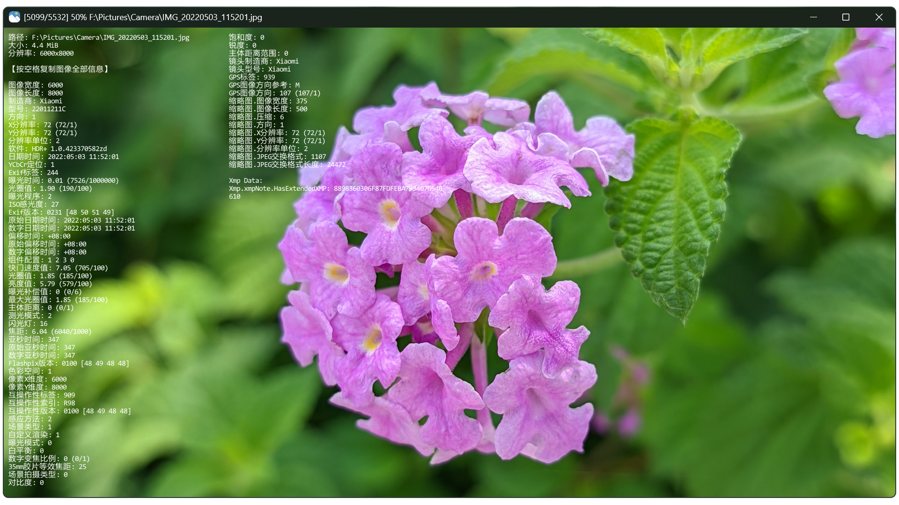

# 🌟 jarkViewer 

    

*一个高效便捷的多格式图片查看工具*



## ✨ 操作方式

1. **⏭ 切换图片**：窗口左右边缘 `单击/滚轮` / `左/右` 方向键 / `空格` 键
1. **🔍 放大缩小**：窗口中间滚轮 / `上/下`方向键
1. **🔄 旋转图片**：窗口左上角或右上角 `单击/滚轮` / `Q/E` 键
1. **🖱️ 平移图片**：鼠标拖动 / `W/A/S/D` 键
1. **ℹ️ 图像信息**：点击滚轮 / `I` 键
1. **🖥️ 切换全屏**：双击窗口 / `F11` 键
1. **📋 复制图像**：`Ctrl + C`
1. **🖨 打印图像**：窗口左下角 `单击` / `Ctrl + P`
1. **❌ 快捷退出**：右键单击 / `ESC` 键

---

## ⚙️ 其他

1. 🍀 全静态链接编译，原生绿色单文件
1. ✅ 自动记忆上次窗口位置/尺寸
1. 🌗 窗口自适应系统 深色/浅色 主题
1. ♟️ 图片透明区域使用国际象棋棋盘背景
1. 📖 支持读取AI生成图像（如 Stable-Diffusion、Flux、ComfyUI）的提示词等信息【前提是图片中包含了提示词信息，不是所有的文生图图片都包含提示词信息的】

---

## 📂 支持的图像格式

- **静态图像**：`apng avif avifs bmp bpg dib exr gif hdr heic heif ico icon jfif jp2 jpe jpeg jpg jxl jxr livp pbm pfm pgm pic png pnm ppm psd pxm qoi ras sr svg tga tif tiff webp wp2`
- **动态图像**：`gif webp png apng jxl bpg`  
- **RAW格式**：`3fr ari arw bay cap cr2 cr3 crw dcr dcs dng drf eip erf fff gpr iiq k25 kdc mdc mef mos mrw nef nrw orf pef ptx r3d raf raw rw2 rwl rwz sr2 srf srw x3f`

## ⚓ 关联文件格式

将脚本 `associate_images.bat` （[下载](https://github.com/jark006/jarkViewer/releases/download/v1.22/associate_images.bat)） 放置到 `jarkViewer.exe` 同一目录下，右键管理员身份运行即可关联图片格式。

## 🚫 取消关联文件格式

将脚本 `associate_images_uninstall.bat` （[下载](https://github.com/jark006/jarkViewer/releases/download/v1.22/associate_images_uninstall.bat)） 右键管理员身份运行即可取消 `jarkViewer` 的关联。

---

## 🔧 DLL 缺失解决方案

请下载并安装 VC++运行库: [Microsoft Visual C++ 2015-2022 Redistributable (x64)](https://aka.ms/vs/17/release/vc_redist.x64.exe)。

---

## 🛠️ 对于开发者

本软件采用全库静态链接，开发者需要在编译前解压所有第三方静态库文件

1. 解压 `jarkViewer/lib/lib.7z` 所有 `*.lib` 静态库
2. 解压 `jarkViewer/libavif/libavif.7z` 所有 `*.lib` 静态库
3. 解压 `jarkViewer/libexiv2/libexiv2.7z` 所有 `*.lib` 静态库
4. 解压 `jarkViewer/libopencv/libopencv.7z` 所有 `*.lib` 静态库
5. 解压 `jarkViewer/libpng/libpng16.7z` 所有 `*.lib` 静态库
6. 解压 `jarkViewer/libwebp2/libwebp2.7z` 所有 `*.lib` 静态库

或者开启vcpkg支持，然后手动安装第三方库 (后续若有新增，此列表可能更新不及时，需开发者自行根据编译缺失信息补充安装)

```sh
vcpkg install giflib:x64-windows-static
vcpkg install x265:x64-windows-static
vcpkg install zlib:x64-windows-static
vcpkg install libyuv:x64-windows-static
vcpkg install exiv2[core,bmff,png,xmp]:x64-windows-static
vcpkg install libavif[core,aom,dav1d]:x64-windows-static
vcpkg install libjxl[core,tools]:x64-windows-static
vcpkg install libheif[core,hevc]:x64-windows-static
vcpkg install libraw[core,dng-lossy,openmp]:x64-windows-static
vcpkg install opencv4[core,ade,contrib,ipp,jasper,jpeg,nonfree,openexr,opengl,openjpeg,png,tiff,webp,world]:x64-windows-static
```

---

## ❤ 支持开发

生活不易，三瓜俩枣都是心意


---

## 📜 License

本项目采用 MIT 许可证开放源代码。了解更多内容，请查看 [LICENSE 文件](https://github.com/jark006/jarkViewer/blob/main/LICENSE)。
