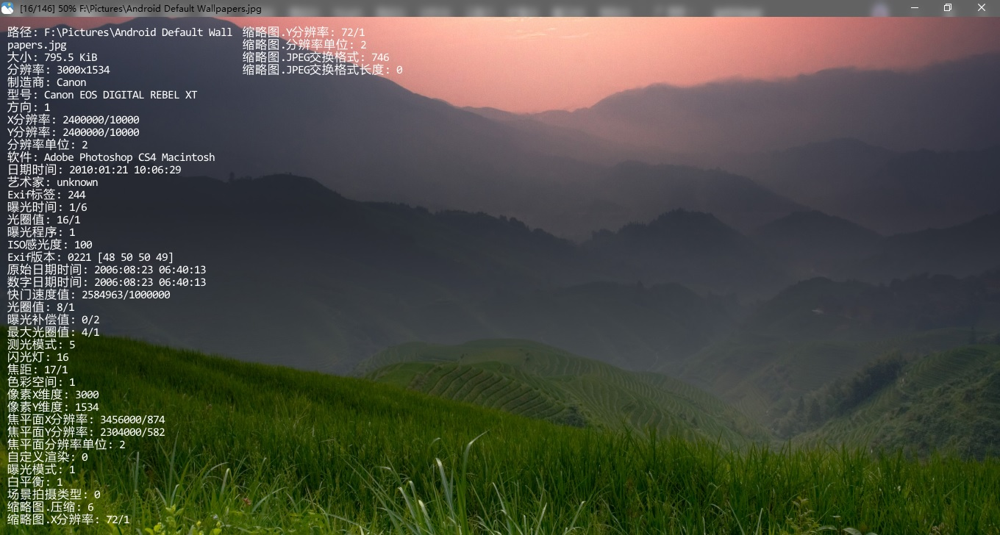

# jarkViewer


A simple image viewer

一个简易图片浏览器

### 编译前操作

1. 解压 `jarkViewer/lib/lib.7z` 所有 `*.lib` 静态库
2. 解压 `jarkViewer/libexiv2/libexiv2.7z` 所有 `*.lib` 静态库
3. 解压 `jarkViewer/libopencv/libopencv.7z` 所有 `*.lib` 静态库
4. 解压 `jarkViewer/libpng/libpng.7z` 所有 `*.lib` 静态库

或者手动安装第三方库
```sh
vcpkg install giflib:x64-windows-static
vcpkg install x265:x64-windows-static
vcpkg install zlib:x64-windows-static
vcpkg install libyuv:x64-windows-static
vcpkg install exiv2[core,bmff,png,xmp]:x64-windows-static
vcpkg install libavif[core,aom,dav1d]:x64-windows-static
vcpkg install libjxl[core,tools]:x64-windows-static
vcpkg install libheif[core,hevc]:x64-windows-static
vcpkg install libraw[core,dng-lossy,openmp]:x64-windows-static
vcpkg install opencv4[core,ade,contrib,default-features,dnn,eigen,ffmpeg,freetype,gdcm,gstreamer,halide,ipp,jasper,jpeg,lapack,nonfree,openexr,opengl,openjpeg,openmp,openvino,ovis,png,python,qt,quirc,sfm,tbb,tiff,vtk,vulkan,webp,world]:x64-windows-static
```

# Preview


